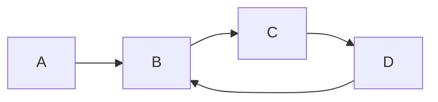

## 双指针的作用

##### 1. 用于检测循环（弗洛伊得查找算法）

设计两个指针（并非一定是指针），**rabbit**(快),  **tortoise**(慢).

**rabbit**每次走两步, **tortoise**每次走一步，则每次**rabbit** 比 **tortoise**多走一步。

如果存在循环**rabbit** 一定会与 **tortoise** 重合

**作用** ：通过双指针判断循环不需要额外的存储空间。