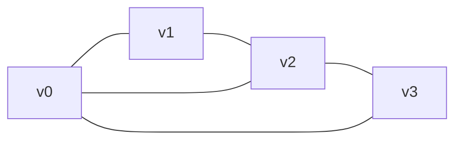
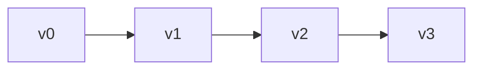
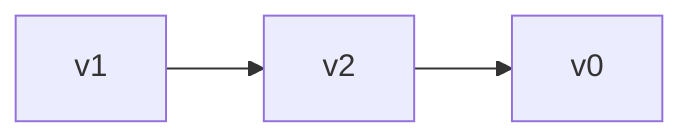
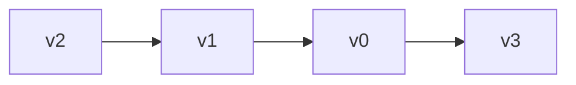
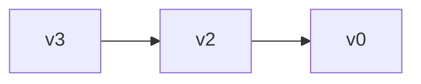

### 图的存储结构

#### 节点设计

```c++
#pragma once
#include<climits>
using vertex_type = char;				//顶点存储的数据
using edge_type = int;					//边权重
const int MAXSIZE =  100;				
const int INFINITY1 = INT_MAX;			//代表网边上权重的无穷（代表不存在边）
struct Matrix {							// 邻接矩阵
	vertex_type vexs[MAXSIZE];
	edge_type arc[MAXSIZE][MAXSIZE];
};

struct EdgeNode {						//邻接矩阵的节点设计
	int adjvex;							//记录下标
	edge_type weight;	
	struct EdgeNode* next;
	EdgeNode() {};
	EdgeNode(int adjvex, edge_type weight) :adjvex(adjvex), weight(weight) {};
};

struct VertexNode {						//邻接表的顶点节点设计
	vertex_type data;
	EdgeNode* firstedge;
};

struct Table {							//邻接表的一维数组
	VertexNode vexs[MAXSIZE];
};
```


#### 邻接矩阵

通过一个**一维数组**存储顶点，一个二**维数组（邻接矩阵）**存储边。

二维数组中比如arc[i] [j] 代表这边（i, j） 或者 <i, j> 

**无权图**中arc[i] [j] = 1 或者 0，1代表有该边，0代表没有该边

**网图（*带权*）**中arc[i] [j] = 0, weight, $\infty$

arc=0 i == j 	0代表不存在自己到自己的边

arc=weight 	代表i到j边的权值为weight

arc=$\infty$ 			代表不存在i到j

```c++
void MatrixGraph(Matrix& target) {
	int numberV = 0, numberE = 0;
	cout << "请输入图的顶点数和边数" << endl;
	cin >> numberV >> numberE;
	cout << "请输入顶点值" << endl;
	for (int i = 0; i < numberV; i++) {
		cin >> target.vexs[i];
	}

	for (int i = 0; i < numberE; i++) {
		for (int j = 0; j < numberE; j++) {
			if (i != j) target.arc[i][j] = INFINITY1;
			else target.arc[i][j] = 0;
		}
	}

	cout << "请输入边(x, y, weight)" << endl;
	for (int k = 0; k < numberE; k++) {
		int i = 0, j = 0, weight = 0;
		cin >> i >> j >> weight;
		target.arc[i][j] = weight;
		target.arc[j][i] = weight;
	}

}
```

**缺点**：明显一旦顶点数确定，那么二维数组的大小便确定了，如果该图没有边，那么这些空间都是无用的，因而当**图的边较为稀疏时，会浪费巨大的空间**

#### 邻接表

一个**一维数组**存储**顶点**，每个顶点（一维数组的一个元素）连接一个链表，链表的每个元素维该顶点的邻接点。

链表用于记录边的信息，解决邻接矩阵空间消耗大的问题。

**边表**：无向图中，邻接的链表称为边表

**出边表**：有向图中，邻接的链表称为出边表

```c++
void ALGraph(Table& target) {
	cout << "请输入需要的节点个数，和边的条数" << endl;
	int numberN = 0, numberE = 0;
	cin >> numberN >> numberE;
	cout << "请输入节点值" << endl;
	for (int i = 0; i < numberN; i++) {
		cin >> target.vexs[i].data;
		target.vexs[i].firstedge = nullptr;
	}
	cout << "请输入边（x, y, weight）" << endl;
	for (int i = 0; i < numberE; i++) {
		int x = 0, y = 0, weight = 0;
		cin >> x >> y >> weight;
		EdgeNode* temp = new EdgeNode(y, weight);
		temp->next = (target.vexs[x].firstedge == nullptr) ?
			nullptr : target.vexs[x].firstedge->next;
		target.vexs[x].firstedge = temp;

		temp = new EdgeNode(x, weight);
		temp->next = (target.vexs[y].firstedge == nullptr) ?
			nullptr : target.vexs[y].firstedge->next;
		target.vexs[y].firstedge = temp;
	}
}
```



**边表为**：

第一列为一维数组顶点，后面为边表：








