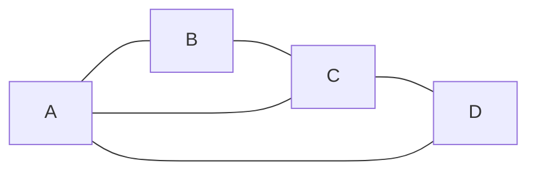
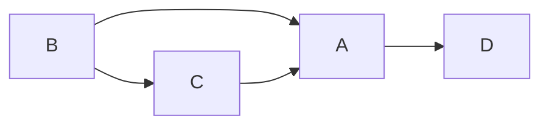
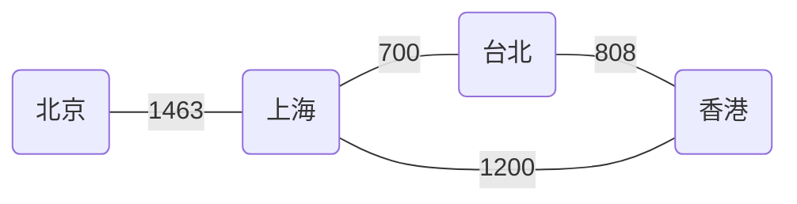

# 图（graph）

[TOC]

### 图的示例

###### 无向图

###### 有向图

### 概念

##### 图的概念

1. 图用**==G(V,E)==**表示，V代表G的**顶点集合**，E代表**边的集合**
2. 顶点：图中的数据元素，相当于树中的节点
3. 顶点集**V**不能为空，边集**E**可以为空

##### 图的分类

###### 1.无向图

1. **无向边**：无方向的边，如无向图中AB, BC......用**==()==**代表无向
2. **无向图**：图G的所有边均为无项边，则交无向图
3. 上图示例中，无向图G(V, E), V = {A, B, C , D}，E = {(A, B), (B, C), (A, C), (C,D), (A, D)}

###### 2.有向图

1. **有向边** ( ==弧== )：有方向的边，如有向图中<A, D>, <B, A>...... 用**==<>==**代表方向
2. **弧尾**与**弧头**：<V~i~, V~j~> 表示从顶点Vi 到 V~j~ 的有向边，V~i~叫 弧尾，V~j~ 叫弧头
3. **有向图**：图中任意两个顶点的边都是有向边
4. 上图示例中，有向图G(V,E), V = {A, B , C, D}, E = {<A, D> , <B, A> , <B, C> , <C, A>}

##### 特殊的图

**网** ：带权的图。

**权**：与图的**边**或者**弧**相关的数。1463 与 700 等等

例如：

##### 图的顶点与边间关系

图G = (V, {E}), (v, v') 属于 {E}   无向图

**邻接点**：顶点**v**与**v'** 互为邻接点

**顶点的度(TD)** ：顶点v的度即为与顶点v相关联的边的条数。上海的度为3(TD = 3)，台北的度为2(TD = 2).

图G = (V, {E}), <v, v'> 属于E   有向图

**入度(ID)**：以顶点v为弧头的有向边的数目为顶点v的入度, 最上图ID(C) = 1

**出度(OD)**:	以顶点v为弧尾的有向边的数目为顶点v的出度，最上图OD(C) = 1

有向图中：TD(v) = ID(v) + OD(v)

##### 路径与环

**路径**：从顶点v到v‘的路径为一个**顶点序列**。例如上海到香港的路径为（上海->台北->香港）（上海->香港）(上海->北京->上海->香港）等等。

**简单路径**：序列中顶点不重复出现的路径叫做简单路径。

**回路（环）**：第一个顶点和最后一个顶点相同的路径。

**简单回路（简单环）**：序列中除了第一个与最后一个相同，其它的均不同。

