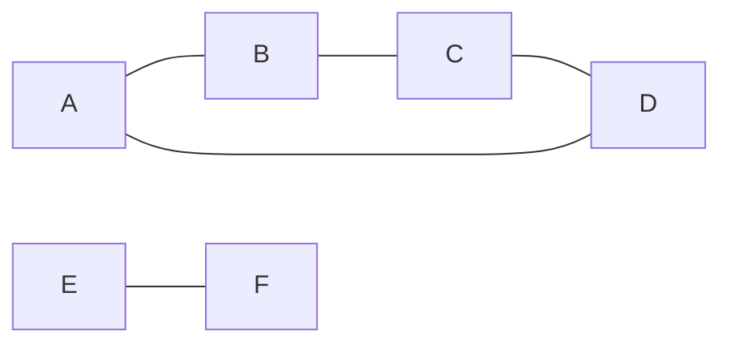
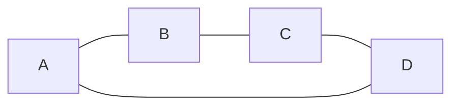
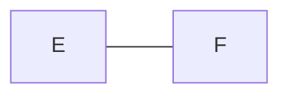
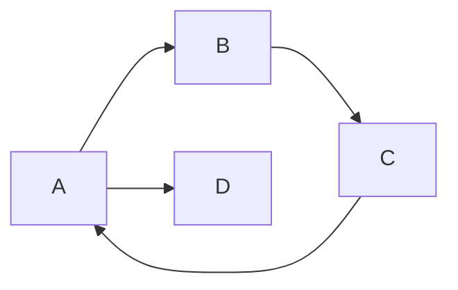
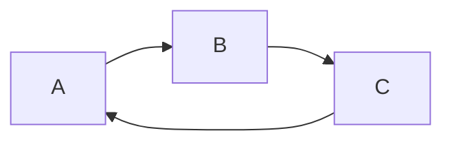
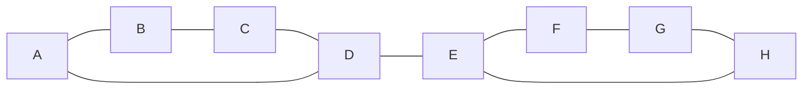
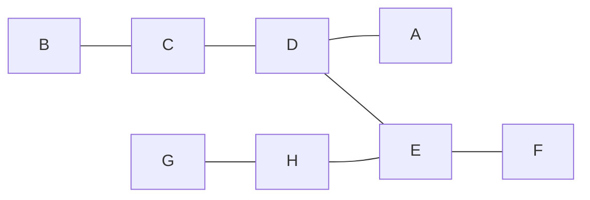

# 连通图

#### 连通图的例子

#### 基本概念

**连通**：顶点v与v'有路径，则称v与v是连通的。

**连通图**：图中任意两点都是连通的，则该图为连通图。上图不是连通图，因为A与E不是连通的。下图是连通的。

**连通分量**：无向图中的极大连通子图。

- 要是子图
- 子图要连通
- 连通子图具有极大的顶点数（不存在增加一个点使得该子图还是连通的）
- 具有极大顶点数的连通子图包含依附这些顶点的所有的边

下图就是上图的**连通分量**，同时下面的图也是器**连通分量**

**强连通图**：在有向图中，每一对顶点均有路径，则称强连通图。

**强连通分量**：在有向图中极大强连通子图称为有向图的强连通分量。

下面图例

上面一张图不是强连通图，因为D 无法走到 A（A-D）(A - B - C - A - D)，下面一张是强连通分量

#### 连通图生成树

一个图有n个顶点，如果边的条数为

- 大于n-1, 则为环
- 小于n-1，则为非连通图
- 等于n-1， 可能为连通图也可能是树

**连通图生成树**：指连通图的一个极小的连通子图（连通图的一个子图），n个顶点，n-1条边

下面是一个连通图8个顶点，9条边(构成两个环)

删去两个边可以满足8个顶点，7条边，树的定义：

**注意：树本身就是一个连通图**

