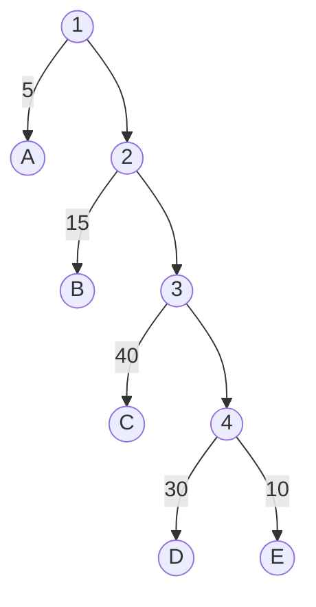

# Huffman Tree

#### 1.叶子节点带权的二叉树的示例

A --> 5,	B--> 15 ......

权为该节点所代表的数据占总数据的比重

#### 2.基本概念

路径：从树中**一个节点**到**另一个节点**的**分支**构成两个节点的路径.

路径长度：路径上的分支数目叫路径长度。1->A (*1*)，1->D(*4*).

树的路径长度：从树根到每个节点的路径长度之和. 上图树的路径长度为1+1+2+2+3+3+4+4 = 20。

节点的带权路径长度：从该结点到**树根节点之**间的**路径长度**与**节点权**的乘积。A: 5*1=5;	B: 15 * 2 = 30

树的带权路径长度（**WPL**）：树中所有**叶子节点**的带权路径的长度之和。5 * 1 + 15 * 2 + 40 * 3 + 30 * 4 + 10 * 4 = 315

 **赫夫曼树**：带权路径长度最小的二叉树叫赫夫曼树

