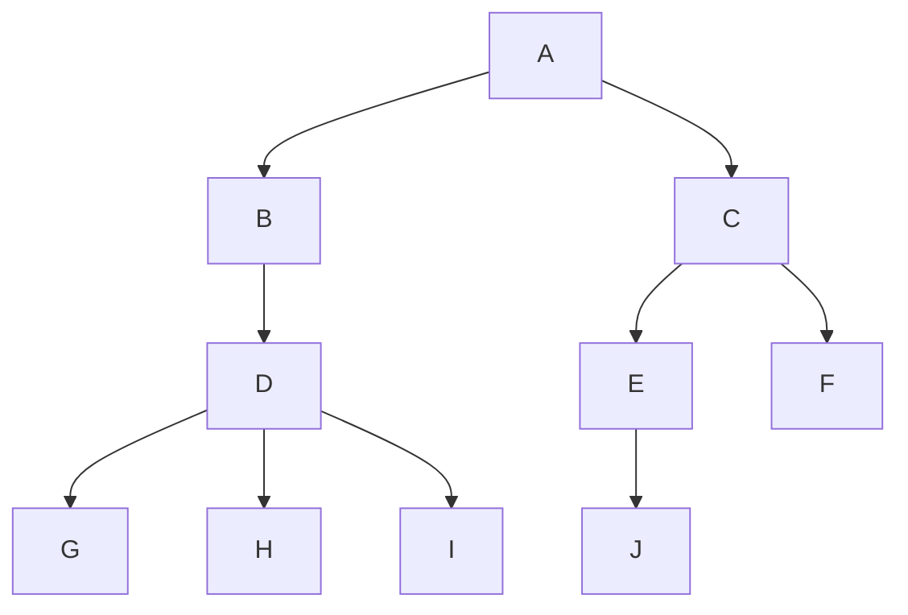
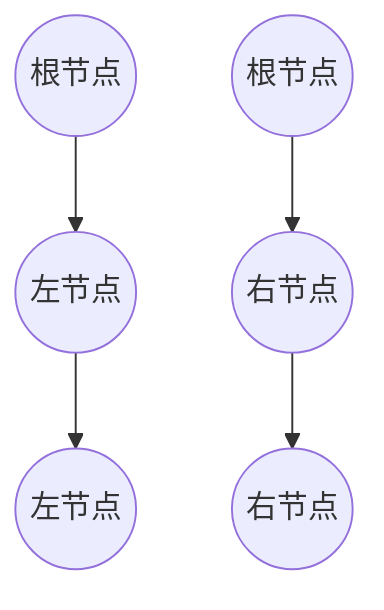
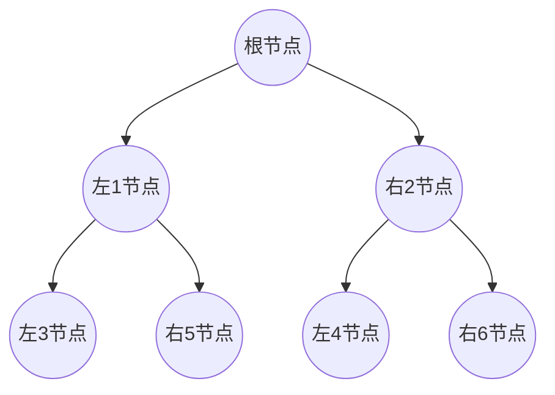
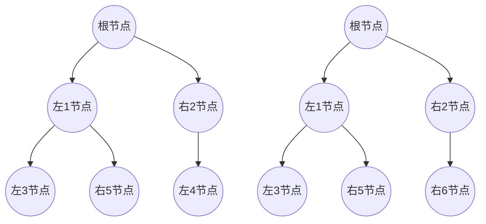

# 树tree --- 1

[TOC]

#### 1.树的基本概念

###### 节点与度：

**树的根节点**：根节点唯一，上图的A。

**子树**：子树是互不相交的，A节点的子树，B出发和C出发。

**节点的度**：节点拥有的子树数称作节点的度。A节点的度为2（B，C），B节点的度为1（D）。

**树的度**：树内各节点的度的最大值，上图的度为3（D）。

1. 叶节点：度为0的节点。
2. 非终端节点（也叫分支节点）：度不为0的节点
3. 内部节点：除根节点外，的分支节点

###### 节点之间的关系：

**孩子**：节点的子树的根节点称为该节点的孩子。A的孩子为B与C

**双亲**：A为B与C的双亲

**兄弟（sibling）**：同一个节点的孩子互为兄弟

**子孙**：节点的祖先为从根到该节点的所有的分支节点

###### 树的最大层次与深度

**节点的层次**：根节点为第一层，根节点的孩子为第二层，依次类推。A为第一层，B，C为第二层，D，E，F为第三层......

**树的深度**：树的最大节点层次为树的深度。上图的树的深度为4.

**森林（forest）**：m棵互不相交的树的集合。B与C的树的集合为一个森林。

#### 特殊的二叉树

###### 1.斜树

所有节点只有**左子树** 或者 所有节点都只有**右子树**，如下图

###### 满二叉树

所有的分支节点都有左右子树，所有的叶节点都在同一层

###### 完全二叉树

在上图的满二叉树基础上，从深度最大开始从右向左依次删去若干节点，删除完深度最大层后继续向上删除。

下图左边为完全二叉树，右边不是完全二叉树:    右边删去的左4节点不是按照上面顺序删去的。

