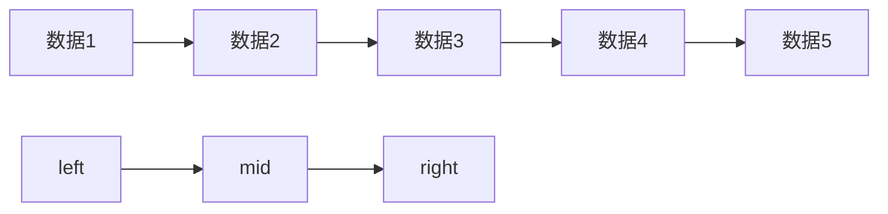

# 二分查找（模板）



用于查找物理存储结构的数据（数组）：

```c++
//在nums2中查找it数据
//nums2为从小到大排序
	int left, right, mid;
    left = 0;
    right = nums2末位下标;
    while(left <= right) {
        mid = (left + right) / 2;
        if(nums2[mid] == it) {
            查找成功
            break;
        }
        else if(nums2[mid] > it) {
            right = mid - 1;
        }
        else if(nums2[mid] < it) {
            left = mid + 1;
        }

    }

```

