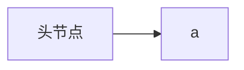
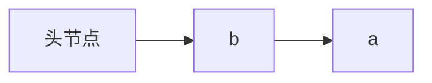
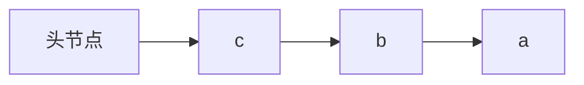
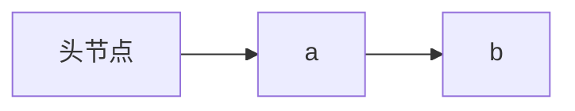
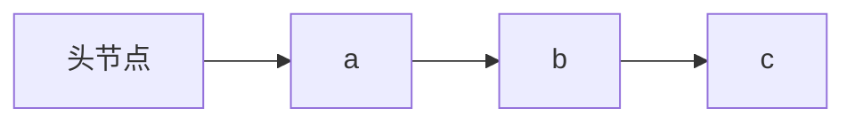

### 线性表---链式存储结构

#### ADT实现代码

**list类**

```c++
#pragma once
#include <cstdlib>
#include <ctime>
typedef int ElemType;
typedef struct Node {
	ElemType data;
	struct Node* next;
};
class list {
public:
	list();
	~list();
	void CreateListHead(int  n);							//创建一个n长度的线性表（调试方便）
	Node* getheadNode() const;								//得到头节点
	bool getElemType(ElemType& target, int i)const;			//得到节点的元素
	bool listInsert(int i, ElemType var);					//插入节点
	bool listDelete(int i, ElemType& target);				//删除节点
private:
	Node* headNode;
};
```


**operator的实现代码**

1. **CreateListHead**

*头插法*

```c++
void list::CreateListHead(int n) {
	//头插法
	srand(time(0));
	Node* p = nullptr;
	for (int i = 0; i < n; i++) {
		p = new Node;
		p->data = rand() % 100 + 1;

		p->next = headNode->next;			//关键
		headNode->next = p;					//关键
	}

}
//	时间复杂度为O(n)
```

将a，b，c依次插入








*尾插法*

```c++
void list::CreateListHead(int n) {
	//尾插法
	Node* rear = headNode;
	Node* p = nullptr;
	for (int i = 0; i < n; i++) {
		p = new Node;
		p->data = rand() % 100 + 1;
		rear->next = p;
		rear = p;
	}
	rear->next = nullptr;

}
```

将a，b，c依次插入






容易知道头插法与尾插法方法插入元素顺序刚好相反

2.其他函数

```c++
list::list() {
	headNode = new Node;
	headNode->next = nullptr;
	headNode->data = 0;
}

Node* list::getheadNode() const {
	return headNode;
}


//时间复杂度为O(n)
bool list::getElemType(ElemType& target, int i) const {
	if (i <= 0) {
		return false;
	}
	int j = 1;
	Node* head = headNode->next;
	for (int j = 1; j < i; j++) {
		head = head->next;
	}
	if (head == nullptr) {
		return false;
	}
	target = head->data;
	return true;
}

//时间复杂度为O(n)
bool list::listInsert(int i, ElemType var) {
	
	Node* head = headNode;
	int j = 1;
	while (head != nullptr && j < i) {
		head = head->next;
		j++;
	}
	if (head == nullptr) {
		return false;
	}
	Node* p = new Node;
	p->data = var;
	p->next = head->next;
	head->next = p;
	return true;
}

//时间复杂度为O(n)
bool list::listDelete(int i,ElemType& target) {
	if (i <= 0) {
		return false;
	}
	Node* head = headNode;
	int j = 1;
	while (head != nullptr && j < i) {
		head = head->next;
		j++;
	}
	if (head == nullptr) {
		return false;
	}
	target = head->next->data;
	Node* temp = head->next->next;
	head->next = temp;

	return true;
}

list::~list() {
	Node* pre;
	Node* lat;
	pre = headNode;
	lat = headNode->next;
	while (lat != nullptr) {
		pre = lat->next;
		free(lat);
		lat = pre;
	}
}


```

#### 优缺点

**优点**：储存的空间可以随时变大或变小，不会像顺序结构那样浪费空间或空间不够

**缺点**：查找复杂度为O(n), 高于线性结构