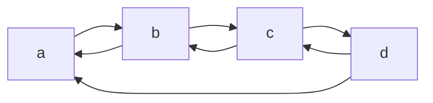

## 双向循环链表



**作用**:  为了避免查找靠后数据是

#### 实现代码：

**头文件**

```C++
#pragma once
#include <cstdlib>
#include <ctime>
typedef int ElemType;
struct DulNode {
	ElemType data;
	DulNode* next;			//指向后继节点
	DulNode* prior;			//指向前驱节点
};

class list {
public:
	list();
	~list();
	void CreateListHead(int n);
	bool listInsert(int i, ElemType var);
	bool listDelete(int i);
	DulNode* getheadNode() const;
private:
	DulNode* headNode;
};
```

**实现函数的代码**:

```c++
#include <cstdio>
//创建头节点
list::list() {
	headNode = new DulNode;
	headNode->next = headNode;		//循环
	headNode->prior = headNode;		//双向
	headNode->data = 0;
}

//销毁函数与单向链表一样，除了循环判断条件
list::~list() {
	DulNode* ptr1 = nullptr;
	DulNode* ptr2 = nullptr;
	ptr1 = headNode;
	ptr2 = headNode->next;
	while (ptr2 != headNode) {		// 最后节点的next-> headNode
		ptr1 = ptr2;
		ptr2 = ptr2->next;
		delete ptr1;
	}
	headNode = nullptr;				
}

void list::CreateListHead(int n) {
	srand(time(0));
	DulNode* ptr = nullptr;
	for (int i = 0; i < n; i++) {
		//头插法
		ptr = new DulNode;

		ptr->data = rand() % 100 + 1;
		ptr->next = headNode->next;
		headNode->next = ptr;			//前三步与创建单向链表相同
		ptr->prior = headNode;			//后两步创建双向
		ptr->next->prior = ptr;
	}
	
}


DulNode* list::getheadNode() const {
	return headNode;
}

bool list::listInsert(int i, ElemType var) {

	DulNode* ptr = headNode;
	//空链表
	if (headNode->next == headNode) {
		return false;
	}
	int j = 0;
	for (j = 1; j < i ; j++) {
		ptr = ptr->next;
		if (ptr == headNode) break;
	}
	//没有这个位置
	if (ptr == headNode && j != 1) {
		return false;
	}
	
	DulNode* temp = new DulNode;		//需要插入的节点
	temp->data = var;					//ptr是需要插入节点位置的前一个位置
	temp->next = ptr->next;
	ptr->next = temp;
	temp->next->prior = temp;
	temp->prior = ptr;
	return true;

}


bool list::listDelete(int i) {
	DulNode* ptr = headNode->next;
	DulNode* temp = nullptr;
	//空表
	if (headNode->next == headNode) {
		return false;
	}
	for (int j = 1; j < i; j++) {
		ptr = ptr->next;
		if (ptr == headNode) {
			return false;
		}
	}
	temp = ptr;
	ptr = ptr->prior;
	ptr->next = temp->next;
	temp->next->prior = ptr;
	return true;
}


```

#### 问题

虽然没有实现查找函数，但查找函数与单链表应该不同，需要判断是从前遍历还是从后面遍历，需要设置判断