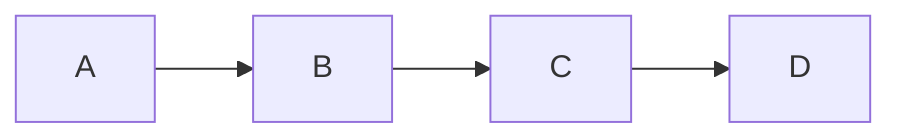

## 线性表----顺序存储

#### 定义

**线性表**：零个或多个数据元素的有限序列



**直接前驱元素**：A为B的直接前驱元素

**直接后继元素**：B为A的直接后继元素

**随机存取结构**：在顺序存储的线性表中，存取元素的复杂度为O(1)，按下标访问，称这样的存储结构为随机存取结构


#### ADT的代码实现

**用类list实现**


**头文件**

```c++
#pragma once
typedef int ElemType;						// 可以通过取别名来实现快速修改线性表的数据类型
const int MAXSIZE = 20;
class list {
public:
	list();									// 初始化函数
	bool GetElem(int i, ElemType& target);	//获取线性表第i个元素的值，用target接受
	bool ListEmpty();						// 判断线线性表是否为空
	void ClearList();						// 清空线性表
	bool ListInsert(int i, ElemType var);	// 向线性表中插入数据
	bool ListDelete(int i, ElemType& target);	//向线性表删除数据
	bool LocateElem(ElemType var);				// 查找var是否位于线性表中
	void unionL(list list_a);					// 将list_a 表中的元素（原表中没有）插入原表末尾
	int length;									// 线性表长度
private:
	ElemType data[MAXSIZE];						// 记录数据的数组（顺序结构）
};
```

**实现代码**

```c++
#include <cstring>
#include <cstdio>
#include "list.h"
using namespace std;
list::list() :length(0) {
	memset(data, 0, sizeof(ElemType) * MAXSIZE);
}

bool list::ListEmpty() {
	if (length == 0) {
		return true;
	}
	else {
		return false;
	}
}

void list::ClearList() {
	length = 0;
	memset(data, 0, sizeof(ElemType) * MAXSIZE);
}

// 		时间复杂度为O(1)
bool list::GetElem(int i, ElemType& target) {
	if (length == 0 || i > MAXSIZE || i <= 0) {
		return false;
	}
	target = data[i - 1];
	return true;
}

//		最坏情况：在头部插入 ， 复杂度为O(n)
//		最好情况： 在尾部插入， 复杂度为O(1)
// 		平均情况： 根据概率假设每个元素插入的相同，故前面的元素插入移动多（i），后面插入移动少（n-1），故平均为中间元素的插入次数O((n+1)/2)=O(n)
bool list::ListInsert(int i, ElemType var) {
	if (length == MAXSIZE || i <= 0 || i >= length + 2) {
		return false;
	}
	int j = 0;
	for (j = length - 1; j >= i - 1; j--) {
		data[j + 1] = data[j];
	}
	data[j + 1] = var;
	length++;
	return true;
}

//ListDelete的复杂度与ListInsert相同
bool list::ListDelete(int i, ElemType& target) {
	if (i <= 0 || i > length || length == 0) {
		return false;
	}
	target = data[i - 1];
	for (int j = i - 1; j < length - 1; j++) {
		data[j] = data[j + 1];
	}
	length--;
	return true;
}

//平均复杂度：O(n)
bool list::LocateElem(ElemType var) {

	for (int i = 0; i < length; i++) {
		if (var == data[i]) {
			return true;
		}
	}
	return false;
}

void list::unionL(list list_a) {

	int length_a = list_a.length;
	ElemType target = 0;
	for (int i = 1; i <= length_a; i++) {
		list_a.GetElem(i, target);
		if (!LocateElem(target)) {
			ListInsert(length + 1, target);
		}
	}
}


```

#### 线性存储的线性表的优缺点

**优点**：

1. 读取储存元素的复杂度低O(1)
2. 不需要为表示元素之间的顺序格外增加空间

**缺点**：

1. 插入与删除元素复杂度高O(n)
2. 最大长度固定
3. 容易造成存储空间的碎片

**适用范围**：固定的存储数据，只进行读取，不经常修改的数据